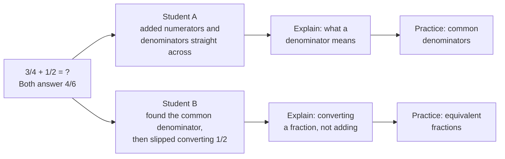
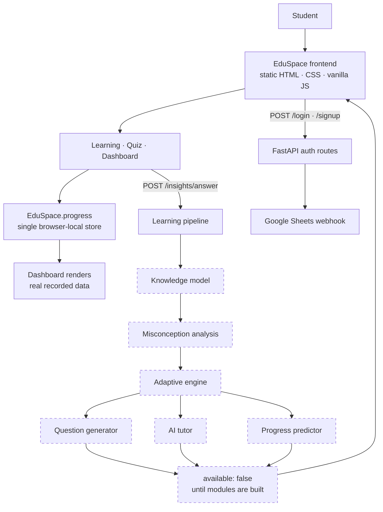

<div align="center">


# ᴇᴅᴜsᴘᴀᴄᴇ

### Personalized learning that understands **why** a student got it wrong — not just that they did.

Most learning platforms mark an answer right or wrong and move on. EduSpace is built around the
question that actually matters: *what does this student misunderstand, and what should they see next?*

<br>


**Built for the AI-Powered Personalized Learning Ecosystem hackathon — Track 04**

</div>

<br>

<div align="center">
  
</div>

---

## ᴡʜᴀᴛ ɪs ᴇᴅᴜsᴘᴀᴄᴇ?

A web-based learning platform for a single student at a time. A student signs up, works through a
topic, practises it, and sees an honest picture of what they actually understand — per topic, not as
one blended score.

The product today is a **working end-to-end learning loop** with a **modular intelligence layer that
is deliberately unimplemented**. Every AI seam exists, is documented, is wired into both the API and
the UI, and currently returns "no analysis available" — which the interface renders as a clean empty
state rather than a fabricated result.

> **On honesty:** nothing in this README is marked as working unless it runs today. The
> misconception engine, knowledge model, adaptive engine, question generator and tutor are
> **integration points, not implementations.** They are described that way throughout.

---

## ᴛʜᴇ ᴘʀᴏʙʟᴇᴍ

```text
What does the student know?
        ↓
What did the student misunderstand?
        ↓
Why did they struggle?
        ↓
What should they learn next?
```

A generic chatbot answers questions. A static quiz platform counts them. Neither builds a model of
*this particular student*. EduSpace is structured so that every answered question flows into a
per-topic knowledge state, and every downstream decision — difficulty, explanation, next topic —
reads from that state rather than from a global score.

---

## ᴛʜᴇ ʜᴀʀᴅ-ᴍᴏᴅᴇ ᴅɪғғᴇʀᴇɴᴛɪᴀᴛᴏʀ

Two students give the **same wrong answer** to the same question. A conventional system gives them
the same correction. That is the failure EduSpace is designed around.



Same question → different reasoning → different misconception → different explanation → different
next step.

**Status: this is the design direction, not a shipped feature.** The architecture routes every
answer through a misconception stage (`backend/ai/misconception.py`) and the UI already has the
surfaces to display its output. The reasoning itself is not built. The landing page presents this
comparison as the product thesis, and the code is arranged so that implementing one module switches
it on without touching the frontend.

---

## ᴡʜʏ ᴇᴅᴜsᴘᴀᴄᴇ

| | |
|---|---|
| **Per-topic knowledge state** | Understanding is tracked per topic, never as one blended percentage. Implemented. |
| **Misconception-aware architecture** | Every answer passes through a dedicated misconception stage before anything is recommended. Seam implemented, reasoning not. |
| **One progress store** | Learning, quiz and dashboard read and write the same store. No page keeps its own private copy. |
| **Honest empty states** | Where the intelligence layer has no answer, the UI says so. No placeholder statistics anywhere. |
| **Modular learning backend** | Six independent modules behind one orchestration pipeline — each can be built and switched on alone. |
| **No build step** | Pure HTML, CSS and vanilla JavaScript. Clone and open. Nothing to compile. |

---

## ғᴇᴀᴛᴜʀᴇs

### sᴛᴜᴅᴇɴᴛ ᴇxᴘᴇʀɪᴇɴᴄᴇ — ɪᴍᴘʟᴇᴍᴇɴᴛᴇᴅ

- Topic-based learning path across a five-topic Fractions unit
- Lesson content with step-by-step explanation per topic
- Practice sets with 20 authored questions, answer evaluation and per-question explanations
- Mark a topic complete, or flag it for review
- Progress recorded on every answer, lesson open and completed set
- Dashboard with per-topic understanding, weak topics, activity feed and quiz statistics
- Session handling, form validation and logout

### ɪɴᴛᴇʟʟɪɢᴇɴᴄᴇ ʟᴀʏᴇʀ — ɪɴᴛᴇɢʀᴀᴛɪᴏɴ ᴘᴏɪɴᴛs, ɴᴏᴛ ɪᴍᴘʟᴇᴍᴇɴᴛᴀᴛɪᴏɴs

| Module | File | Status |
|---|---|---|
| Knowledge modelling | `backend/learning/knowledge_model.py` | Interface defined, returns `None` |
| Misconception detection | `backend/ai/misconception.py` | Interface defined, returns `None` |
| Adaptive difficulty / path | `backend/learning/adaptive_engine.py` | Interface defined, returns `None` |
| Question generation | `backend/ai/question_generator.py` | Interface defined, returns `None` |
| AI tutor explanations | `backend/ai/tutor.py` | Interface defined, returns `None` |
| Progress prediction | `backend/learning/progress_predictor.py` | Interface defined, returns `None` |

All six are called by a real orchestration pipeline (`backend/learning/pipeline.py`) and exposed over
HTTP. `GET /insights/status` reports which stages are implemented; the frontend reads that and
chooses between real analysis and an empty state.

### ᴘʟᴀᴛғᴏʀᴍ — ɪᴍᴘʟᴇᴍᴇɴᴛᴇᴅ

Authentication API · learning interface · quiz interface · dashboard · insights API · browser-local
progress persistence

---

## sᴄʀᴇᴇɴsʜᴏᴛs

<table>
<tr>
<td width="50%"><br><sub><b>Learning</b> — topic path, lesson steps, and a tutor note that stays empty until a real analysis exists</sub></td>
<td width="50%"><br><sub><b>Quiz</b> — answer evaluation with the explanation for the specific question</sub></td>
</tr>
<tr>
<td colspan="2"><br><sub><b>Dashboard</b> — per-topic understanding, weak topics, and an activity feed built entirely from recorded answers</sub></td>
</tr>
<tr>
<td colspan="2"><br><sub><b>Flip cards</b> — the four stages of the learning loop, one card turned</sub></td>
</tr>
</table>

---

## ᴀʀᴄʜɪᴛᴇᴄᴛᴜʀᴇ



Dashed nodes are integration points that currently return no data.

---

## ᴛᴇᴄʜ sᴛᴀᴄᴋ

### ғʀᴏɴᴛᴇɴᴅ
Static **HTML5**, **CSS3** (custom properties, grid, flexbox) and **vanilla JavaScript** (ES2020,
IIFE modules on a single `window.EduSpace` namespace). No framework, no bundler, no build step.
Typography is **Fraunces** + **Inter** via Google Fonts.

### ʙᴀᴄᴋᴇɴᴅ
**Python** with **FastAPI**, served by **Uvicorn**. **Pydantic** for request schemas,
**python-dotenv** for configuration, **requests** for the outbound webhook call,
**email-validator** for address validation.

### AI / ʟᴇᴀʀɴɪɴɢ ʟᴀʏᴇʀ
Six plain Python modules under `backend/ai/` and `backend/learning/`, orchestrated by
`pipeline.py` and exposed through `insights_router.py`. **No model provider, no ML library and no
inference code is present** — these are typed, documented interfaces.

### ᴅᴀᴛᴀ / sᴛᴏʀᴀɢᴇ
No database. Authentication is forwarded to a **Google Apps Script webhook** backed by a Google
Sheet. Learning progress is stored in the browser's **localStorage** under a single documented
schema (`eduspace_progress`), which makes it per-device and per-browser.

### ᴛᴏᴏʟɪɴɢ
Python's built-in `http.server` is enough to serve the frontend. No package manager, task runner or
compiler is required on the frontend side.

---

## ᴘʀᴏᴊᴇᴄᴛ sᴛʀᴜᴄᴛᴜʀᴇ

```text
eduspace/
├── index.html                  Landing — problem statement, four-stage loop, about, support
├── login.html  signup.html     Authentication
├── learning.html               Topic path and lesson content
├── quiz.html                   Practice sets
├── dashboard.html              Student progress and insights
│
├── assets/
│   ├── css/
│   │   ├── base.css            Design tokens, reset, nav, footer, buttons, motion system
│   │   ├── index.css           Landing page, flip cards
│   │   ├── auth.css            Layout shared by login and signup
│   │   ├── login.css  signup.css
│   │   ├── learning.css  quiz.css  dashboard.css
│   ├── js/
│   │   ├── common.js           Namespace, API helper, session, progress store, insights seam,
│   │   │                       nav and the scroll-reveal observer. Loaded first on every page.
│   │   ├── curriculum.js       Authored lesson and question content, shared topic IDs
│   │   ├── index.js            Flip-card interaction
│   │   ├── login.js  signup.js Auth forms and validation
│   │   ├── learning.js         Topic selection, lesson rendering, progress recording
│   │   ├── quiz.js             Question flow, evaluation, feedback, scoring, recording
│   │   └── dashboard.js        Renders real data, or an empty state
│   └── images/                 Logo, derived nav mark, favicons, screenshots
│
├── backend/
│   ├── server.py               FastAPI app, CORS, router registration
│   ├── data/
│   │   ├── login.py            POST /login   → Sheets webhook
│   │   ├── signup.py           POST /signup  → Sheets webhook
│   │   └── upload_data.py      Empty placeholder, unused
│   ├── learning/
│   │   ├── pipeline.py         Orchestrates the six modules in order
│   │   ├── insights_router.py  /insights/* routes
│   │   ├── knowledge_model.py  ─┐
│   │   ├── adaptive_engine.py   ├─ integration points, all return None
│   │   └── progress_predictor.py┘
│   └── ai/
│       ├── misconception.py    ─┐
│       ├── question_generator.py├─ integration points, all return None
│       ├── tutor.py            ─┘
│       └── ai_agent.py         Earlier stub set, currently unused
│
└── requirements.txt
```

---

## ʜᴏᴡ ᴛʜᴇ sʏsᴛᴇᴍ ᴡᴏʀᴋs

1. Student signs up — `POST /signup` forwards to the Sheets webhook
2. Student logs in — `POST /login`; the session is normalised and stored client-side
3. Student opens a topic on the learning page — the open is recorded
4. Student starts a practice set for that topic — the topic ID travels in the URL
5. Each answer is evaluated, explained, and written to `EduSpace.progress`
6. The same answer is posted to `/insights/answer`, which runs the pipeline
7. The pipeline returns `available: false` today, so no analysis is displayed
8. Finishing a set records the session and marks the topic covered
9. The dashboard reads the store and renders understanding, weak topics and activity

Weak topics are currently identified by a **plain threshold** — below 60% correct across at least
three answers — and the code says so explicitly. That is arithmetic, not misconception detection.
When `misconception.py` is implemented, its output takes priority automatically.

---

## ᴅᴀsʜʙᴏᴀʀᴅ

Everything shown is computed from answers the student actually gave.

| Panel | Source |
|---|---|
| Overall understanding | correct ÷ answered, across practised topics only |
| Weak topics | plain threshold (<60% over ≥3 answers), labelled as such |
| Day streak | consecutive days with recorded activity |
| Questions answered | total, plus a 7-day count |
| Understanding by topic | per-topic percentage, lowest first |
| Recent activity | lesson opens, answers, completed sets, completions |
| Topics attempted / completed | counted against the curriculum |

With no data, every panel shows a written empty state. There are no seeded numbers anywhere.

---

## ɢᴇᴛᴛɪɴɢ sᴛᴀʀᴛᴇᴅ

### 1. ᴄʟᴏɴᴇ

```bash
git clone <your-repository-url>
cd eduspace
```

> This project folder does not currently contain a git remote — substitute your own repository URL.

### 2. ʙᴀᴄᴋᴇɴᴅ

From the project root:

```bash
python -m venv venv
```

```powershell
venv\Scripts\activate          # Windows PowerShell
```

```bash
source venv/bin/activate       # macOS / Linux
```

```bash
pip install -r requirements.txt
```

Then start the API **from the `backend` directory**:

```bash
cd backend
python server.py
```

That runs Uvicorn on `http://127.0.0.1:8000` with reload enabled. The equivalent explicit command is:

```bash
uvicorn server:app --reload --host 127.0.0.1 --port 8000
```

Interactive API docs are then at `http://127.0.0.1:8000/docs`.

### 3. ғʀᴏɴᴛᴇɴᴅ

The frontend is static — there is no Node server and nothing to build. Serve the project root:

```bash
python -m http.server 5500
```

Open `http://127.0.0.1:5500/index.html`.

> Serving over HTTP is recommended. Opening the files directly with `file://` works for browsing,
> but browsers block `fetch` to the API from that origin, so login and signup will not complete.

The frontend expects the API at `http://127.0.0.1:8000`, set once in
`assets/js/common.js` as `EduSpace.API_BASE_URL`.

**The learning, quiz and dashboard pages work without the backend running.** Only signup and login
require it.

---

## ᴄᴏɴғɪɢᴜʀᴀᴛɪᴏɴ

One environment variable, read by the backend:

```ini
# backend/.env
SHEETS_SCRIPT_API=<your Google Apps Script web-app URL>
```

If it is missing, `/login` and `/signup` return a clean `503` and log the reason server-side rather
than crashing.

> **Never commit secrets or API keys.** This project has no `.gitignore` yet and a `.env` file is
> present in the working tree — add `.env` to a `.gitignore` before publishing the repository, and
> rotate the webhook URL if it has already been pushed.

Passwords are currently forwarded to the Sheets webhook in cleartext and stored unhashed. That is a
known limitation of the prototype storage layer, listed in the roadmap below.

---

## API ʀᴇғᴇʀᴇɴᴄᴇ

| Method | Endpoint | Purpose | Status |
|---|---|---|---|
| `GET` | `/` | Health check | Implemented |
| `POST` | `/signup` | Create an account via the Sheets webhook | Implemented |
| `POST` | `/login` | Authenticate via the Sheets webhook | Implemented |
| `GET` | `/insights/status` | Which pipeline stages are implemented | Implemented — reports all false |
| `POST` | `/insights/answer` | Run one answered question through the pipeline | Implemented — returns `available: false` |
| `GET` | `/insights/knowledge` | Per-topic mastery for a student | Awaiting `knowledge_model.py` |
| `GET` | `/insights/misconceptions` | Active misconceptions | Awaiting `misconception.py` |
| `GET` | `/insights/tutor-note` | Tutor note for a student and topic | Awaiting `tutor.py` |
| `GET` | `/insights/questions` | Generated practice questions | Awaiting `question_generator.py` |

CORS is open (`allow_origins=["*"]`) for local development.

---

## ᴅᴇsɪɢɴ ᴀɴᴅ ᴍᴏᴛɪᴏɴ

EduSpace should read as an education product, not a science-fiction interface. The palette is
sampled directly from the logo — deep navy `#04287E`, cobalt `#1A64BE`, azure `#2596E5`, bright sky
`#3DBFF8`, over cool near-white neutrals. `base.css` is the only file that defines colour.

Text contrast is verified against WCAG AA: cobalt on surface 4.99:1, white on cobalt 5.82:1,
body text on background 15.24:1.

### ᴍᴏᴛɪᴏɴ & ɪɴᴛᴇʀᴀᴄᴛɪᴏɴ

One system, four movements, driven by a single IntersectionObserver:

| Movement | Used for | Duration |
|---|---|---|
| **Flip** | Feature and information cards turning over | 760 ms |
| **Slide** | Sections and content blocks entering the viewport | 620 ms |
| **Rise** | Cards, buttons and panels lifting on hover | 320 ms |
| **Reveal** | Text and supporting content fading in | 620 ms |

**Subtle 3D depth** comes from perspective on card containers, two-layer shadows and small
transforms — a card sits slightly off the page and lifts 3 px on hover. Not from glow.

**Low velocity is deliberate.** Nothing moves faster than 320 ms and travel stays between 2 px and
22 px (14 px on mobile). Hover lifts are gated behind `@media (hover: hover)` so a tap never leaves
a card stuck, and `prefers-reduced-motion` disables the lot.

**No AI-themed effects.** No neural-network backgrounds, particles, holograms, circuit graphics,
scanning sweeps or perpetual gradients — verified as zero looping animations on every page. The
intelligence is meant to show in what the product does, not in decoration.

---

## 60-sᴇᴄᴏɴᴅ ᴊᴜᴅɢᴇ ᴅᴇᴍᴏ

```text
1.  Open index.html            — read the thesis: same wrong answer, different reasons
2.  Click a flip card          — the four stages: understand, diagnose, adapt, explain
3.  Go to Learning             — pick a topic, read the steps
4.  Note the tutor note        — deliberately empty; no invented diagnosis
5.  Practice this topic        — answer one correctly, one incorrectly
6.  Read the feedback          — the explanation is specific to that question
7.  Finish the set             — see the score summary
8.  Open Dashboard             — the numbers are exactly what you just did
9.  GET /insights/status       — every stage reports implemented: false, by design
```

Steps 3–8 need no backend. Step 9 needs the API running.

---

## ʜᴀᴄᴋᴀᴛʜᴏɴ ᴀʟɪɢɴᴍᴇɴᴛ — ᴛʀᴀᴄᴋ 04

| Requirement | Status | How EduSpace addresses it |
|---|---|---|
| Student knowledge modelling | **Prototype foundation** | Per-topic state (answered, correct, opened, completed, flagged) is recorded and rendered today. `knowledge_model.py` is the seam for a real mastery estimate. |
| Adaptive difficulty | **Planned** | `adaptive_engine.py` defines `recommend_difficulty()` and `next_step()`; the quiz already asks the pipeline before falling back to the authored set. |
| Personalized learning paths | **Partially implemented** | Topic order, completion and review flags are per student and drive what the learning page opens next. Adaptive re-ordering is not built. |
| Automatic question generation | **Planned** | `question_generator.generate_for_topic()` is called by the quiz on load; returning `None` makes it use the 20 authored questions. |
| Weak-topic detection | **Implemented (non-AI)** | Plain threshold: <60% correct over ≥3 answers, surfaced on the dashboard and labelled honestly as a threshold. |
| Learning-progress prediction | **Planned** | `progress_predictor.predict()` interface defined and wired into the pipeline. |
| Teacher analytics | **Not started** | Out of scope for this build. No teacher role exists. |
| **Hard mode —** different explanations and paths for different misconceptions behind the *same* wrong answer | **Design direction, architecture in place** | The pipeline routes every incorrect answer through `misconception.detect()` before `adaptive_engine` and `tutor`, and the UI has the surfaces to display both. The inference itself is not implemented, and nothing fabricates it. |

---

## ʀᴏᴀᴅᴍᴀᴘ

All items below are **future work**, not shipped features.

- Misconception inference — the core piece; classify *why* an answer is wrong, not just that it is
- Knowledge modelling with confidence, not just a percentage correct
- Adaptive difficulty and question selection driven by that model
- Generated practice questions targeting a detected misconception
- Tutor explanations written against the specific error a student made
- Learning-progress prediction
- Server-side persistent student profiles, replacing browser-local progress
- Password hashing and a real user store, replacing the Sheets webhook
- Teacher analytics
- Coverage beyond the single Fractions unit
- Evaluation harness to measure whether the reasoning layer is actually right

---

## ᴛᴇᴀᴍ

The project presents five roles on its About section — Founder / Lead (product and strategy),
AI & ML (diagnosis engine), Frontend (product experience), Backend (platform and data), and
Education / Research (curriculum and pedagogy). Individual names are not published in the project,
so none are listed here.

Contact goes through the channels below.

---

## ʟɪᴄᴇɴsᴇ

No licence file is present in this repository. All rights are reserved by default until one is
added. If you intend to open-source it, add a `LICENSE` file and state the licence here.

---

<div align="center">


### ᴇᴅᴜsᴘᴀᴄᴇ

> Personalized learning that understands the student, not just the answer.

Built for the **AI-Powered Personalized Learning Ecosystem** hackathon — Track 04

<br>

[](https://instagram.com/tech_by_niteshh)
[](https://x.com/tech_by_niteshh)
[](https://www.linkedin.com/in/nitesh-chaurasiya-a7b2aa3a5/)
[](https://t.me/tech_by_niteshh)

**Support** · [+1 (405) 2559594](tel:+14052559594) · [niteshh0x0@gmail.com](mailto:niteshh0x0@gmail.com) · [Telegram](https://t.me/tech_by_niteshh)

<sub>© 2026 EduSpace. All rights reserved.</sub>

</div>
